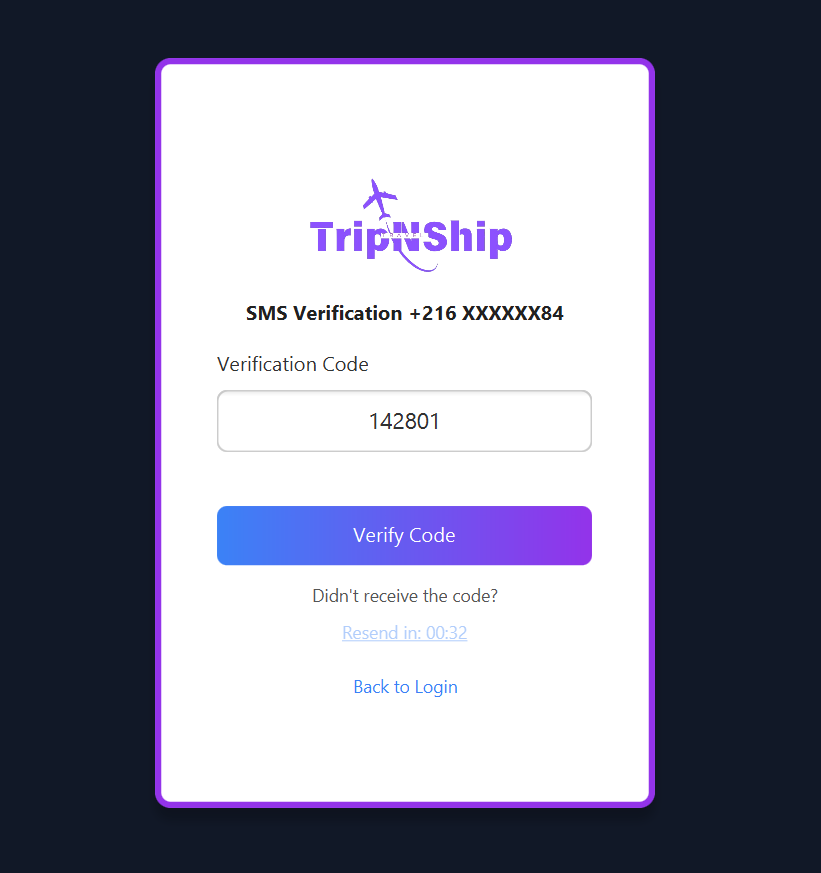
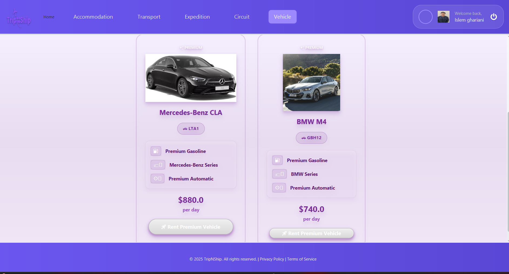

# TripNShip

An all-in-one JavaFX application for comprehensive travel and shipment management, offering seamless booking experiences and real-time tracking capabilities.

## Features

- **Transportation Booking**: Book flights, trains, buses, and other transport options
- **Accommodation Management**: Hotel and lodging reservations
- **Vehicle Rentals**: Car, bike, and specialty vehicle rentals
- **Tour Planning**: Guided tours and travel packages
- **Shipment Tracking**: Real-time tracking for national and international shipments
- **Advanced Authentication**: Multi-factor authentication with Face ID support

## 📸 Screenshots

<!-- Login view -->


<!-- Face-ID login -->


<!-- Forget PWD view -->


<!-- SMS Verification -->


<!-- Reset PWD -->


<!-- User Profile view -->


<!-- Main Dashboard -->


<!-- UserManagement Dashboard -->


<!-- Itinerary Dashboard -->


<!-- Accommodation Dashboard -->


<!-- Vehicule Dashboard -->


<!-- Expedition Dashboard -->


<!-- Home -->


<!-- Booking Room -->


<!-- Room Details -->


<!-- Payment -->


<!-- Booking Trip -->


<!-- Expedition List Details Track -->


<!-- Booking Car -->


<!-- Booking Circuit -->

## 🏗️ Architecture

### Technology Stack
- **Java 17**: Modern Java features and performance
- **JavaFX**: Rich desktop application framework
- **Maven**: Dependency management and build automation
- **MVC Pattern**: Clean separation of concerns
- **Flask**: Python microservice for Face ID authentication

### Project Structure
```
TripNShip/
├── src/
│   ├── main/
│   │   ├── java/
│   │   │   ├── controllers/     # MVC Controllers
│   │   │   ├── models/          # Data models
│   │   │   ├── views/           # JavaFX views
│   │   │   └── utils/           # Shared utilities
│   │   └── resources/           # FXML, CSS, assets , FaceRecognationServer
├── modules/
│   ├── user-management/         # Authentication & user handling
│   ├── circuit-management/      # Travel circuits
│   ├── expedition-management/   # Shipment handling
│   ├── accommodation-management/# Hotel bookings
│   └── transport-management/    # Transportation
└── pom.xml                      # Maven configuration
```

## 👥 Team & Modules

### Core Contributors

| Developer | Module | Key Features |
|-----------|---------|--------------|
| **@ghirr** | User Management | Authentication, Face ID, Password Recovery |
| **@SirineKchaou** | Circuit Management | Travel route planning and optimization |
| **@ZainebKorbi** | Expedition Management | Shipment tracking and logistics |
| **@YJAZIR** | Accommodation Management | Hotel booking and management |
| **@IyedABDELLI** | Transport Management | Transportation booking and scheduling |

## 🔐 User Management Module

### Authentication Features
- **Traditional Auth**: Secure login/signup with BCrypt password hashing
- **Google OAuth**: Seamless Google account integration
- **Face ID Authentication**: Advanced facial recognition system
- **Password Recovery**: Automated system using Trello API + email notifications

### Face ID Implementation
- **Flask Server**: Python microservice for facial recognition processing
- **DeepFace**: State-of-the-art face recognition library
- **NumPy**: Efficient numerical computations for face encoding
- **Real-time Comparison**: Live face matching against stored encodings

### Security Features
- BCrypt password hashing
- Secure session management
- Multi-factor authentication options
- Automated account recovery

## 🚀 Getting Started

### Prerequisites
- Java 17 or higher
- Maven 3.6+
- Python 3.8+ (for Face ID service)
- Git

### Installation

1. **Clone the repository**
   ```bash
   git clone https://github.com/ghirr/TripNShip.git
   cd TripNShip
   ```

2. **Build the project**
   ```bash
   mvn clean install
   ```

3. **Set up Face ID service**
   ```bash
   cd face-id-service
   pip install -r requirements.txt
   python app.py
   ```

4. **Run the application**
   ```bash
   mvn javafx:run
   ```

### Configuration

1. **Database Setup**: Configure your database connection in `src/main/java/org/Esprit/TripNShip/Utils/MyDataBase.java`
2. **API Keys**: Add your Google OAuth and other API keys
3. **Face ID Service**: Ensure the Flask server is running on the configured port

## 📱 API Integrations

The project integrates with various external services:
- **PayPal Integration**: Secure transaction processing
- **Mapping Services**: Route optimization and location services
- **Google OAuth**: Authentication service
- **Trello API**: Task management for password recovery
- **Email Services**: Automated notifications

## 🎯 Key Features by Module

### Circuit Management
- Route planning and optimization
- Multi-destination itineraries
- Cost calculation and comparison

### Expedition Management
- Real-time shipment tracking
- International shipping support
- Delivery status notifications

### Accommodation Management
- Hotel search and booking
- Room availability checking
- Booking management

### Transport Management
- Multi-modal transportation booking
- Schedule management
- Route optimization


## 🔧 Development

### Branch Structure
- `main`: Production-ready code
- `Module_Name`: Integration branch for each Module

### Contributing
1. Fork the repository
2. Create a feature branch
3. Commit your changes
4. Push to the branch
5. Create a Pull Request


**Built with ❤️ by the TripNShip Team**

*Making travel and shipping management effortless, one click at a time!*
